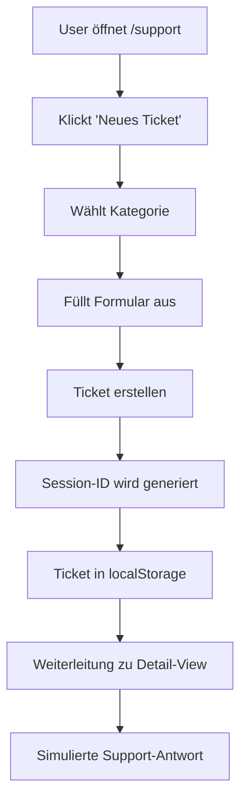
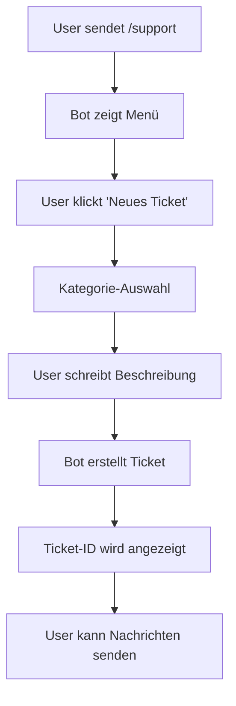
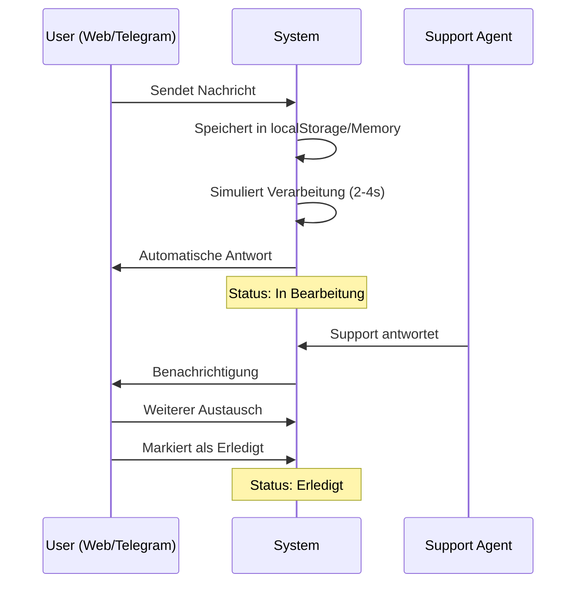

# 🎫 NEBULA Support Ticket System

Ein professionelles, durchdachtes Support-Ticket-System mit anonymer Telegram-Integration.

## ✨ Features

### 🌟 **Web-Oberfläche**
- **Modernes UI/UX Design** mit Glassmorphismus und Animationen
- **100% Anonym** - Keine Registrierung erforderlich
- **Kategorie-basiertes System** - 6 vordefinierte Kategorien
- **Echtzeit-Chat-Interface** - Nahtlose Kommunikation
- **Status-Tracking** - Offen, In Bearbeitung, Wartet, Erledigt
- **Prioritäts-Management** - Low, Medium, High, Critical
- **Such- und Filterfunktionen** - Schnelles Finden von Tickets
- **Responsive Design** - Optimiert für Mobile und Desktop

### 🤖 **Telegram Integration**
- **Bot-Commands** - `/support` für Support-Menü
- **Interaktive Buttons** - Intuitive Navigation
- **Kategorie-Auswahl** - Schnelle Ticket-Erstellung
- **Message-Threading** - Nachrichten direkt im Bot senden
- **Status-Updates** - Echtzeit-Benachrichtigungen
- **FAQ-System** - Häufige Fragen & Antworten

### 🔒 **Datenschutz & Sicherheit**
- **Anonyme Sessions** - Automatische Session-IDs
- **Lokale Speicherung** - Tickets im Browser gespeichert
- **Keine Pflicht-Registrierung** - Optional: Name & E-Mail
- **DSGVO-konform** - Datenschutz by Design

---

## 📂 Dateistruktur

```
NebulaCodex/
├── apps/
│   ├── bot/
│   │   └── src/
│   │       ├── flows/
│   │       │   └── supportTickets.ts      # Telegram Bot Flow
│   │       ├── api/
│   │       │   └── ticketBridge.ts        # Web ↔ Telegram Bridge
│   │       └── types.ts                   # Type Definitions
│   │
│   └── web/
│       └── src/
│           ├── pages/
│           │   └── SupportPage.tsx        # Haupt-Support-Seite
│           └── components/
│               └── support/
│                   ├── types.ts           # Type Definitions
│                   ├── TicketList.tsx     # Ticket-Übersicht
│                   ├── TicketCreate.tsx   # Ticket-Erstellung
│                   └── TicketDetail.tsx   # Ticket-Detail & Chat
```

---

## 🚀 Verwendung

### **Web-Oberfläche**

1. **Zugriff**: Navigiere zu `/support` in der Web-App
2. **Ticket erstellen**:
   - Klicke auf "Neues Ticket"
   - Wähle eine Kategorie (Bestellung, Zahlung, Versand, etc.)
   - Optional: Name und E-Mail angeben
   - Betreff und Beschreibung eingeben
   - "Ticket erstellen" klicken

3. **Tickets verwalten**:
   - "Meine Tickets" zeigt alle deine Tickets
   - Such- und Filterfunktionen nutzen
   - Ticket anklicken für Details

4. **Kommunikation**:
   - Nachrichten im Chat-Interface schreiben
   - Simulierte Support-Antworten nach 2-4 Sekunden
   - Ticket als "Erledigt" markieren wenn gelöst

### **Telegram Bot**

1. **Support-Menü öffnen**:
   ```
   /support
   ```

2. **Neues Ticket erstellen**:
   - Klicke "🆕 Neues Ticket erstellen"
   - Wähle eine Kategorie
   - Beschreibe dein Anliegen
   - Ticket wird automatisch erstellt

3. **Tickets verwalten**:
   - "📋 Meine Tickets" anzeigen
   - Ticket auswählen für Details
   - "💬 Nachricht senden" für Kommunikation
   - "✅ Als erledigt markieren" zum Schließen

4. **FAQ durchsuchen**:
   - "❓ FAQ" öffnen
   - Thema auswählen (Versand, Zahlung, etc.)
   - Bei Bedarf Ticket erstellen

---

## 🎨 Design-System

### **Farbpalette**

```css
/* Kategorien */
Bestellung:  from-blue-500 to-cyan-500
Zahlung:     from-green-500 to-emerald-500
Versand:     from-orange-500 to-amber-500
Rückgabe:    from-purple-500 to-pink-500
Technisch:   from-red-500 to-rose-500
Sonstiges:   from-gray-500 to-slate-500

/* Status */
Offen:           bg-green-500
In Bearbeitung:  bg-yellow-500
Wartet:          bg-orange-500
Erledigt:        bg-blue-500

/* Priorität */
Niedrig:    text-gray-400
Mittel:     text-yellow-400
Hoch:       text-orange-400
Kritisch:   text-red-400
```

### **Komponenten-Architektur**

```tsx
SupportPage                    // Haupt-Container
├── TicketList                 // Listen-Ansicht
│   ├── SearchBar             // Suche
│   ├── FilterDropdown        // Status-Filter
│   └── TicketCard[]          // Ticket-Karten
├── TicketCreate               // Erstellungs-Formular
│   ├── CategorySelector      // Kategorie-Auswahl
│   ├── UserInfoForm          // Optional: Name/Email
│   └── TicketForm            // Betreff/Beschreibung
└── TicketDetail               // Detail-Ansicht
    ├── TicketHeader          // Info & Status
    ├── MessageList           // Chat-Historie
    └── MessageInput          // Nachricht senden
```

---

## 🔌 API & Integration

### **Ticket Bridge API**

Die `TicketBridge`-Klasse ermöglicht Synchronisation zwischen Web und Telegram:

```typescript
import { ticketBridge } from './api/ticketBridge';

// Telegram zu Web synchronisieren
await ticketBridge.syncTelegramToWeb(telegramUserId, ticket);

// Web zu Telegram synchronisieren
await ticketBridge.syncWebToTelegram(webTicket, telegramUserId);

// Telegram User benachrichtigen
await ticketBridge.notifyTelegramUser(userId, 'Neue Nachricht!');

// Anonymen Link generieren
const link = ticketBridge.generateAnonymousLink(ticketId);
```

### **Lokale Speicherung**

```typescript
// Session-ID
localStorage.getItem('nebula_support_session')

// Tickets
localStorage.getItem(`nebula_tickets_${sessionId}`)

// User-Info (optional)
localStorage.getItem('nebula_user_name')
localStorage.getItem('nebula_user_email')
```

---

## 📱 Telegram Bot Commands

| Command | Beschreibung |
|---------|-------------|
| `/support` | Öffnet das Support-Menü |

### **Inline-Buttons**

| Button | Action |
|--------|--------|
| 🆕 Neues Ticket erstellen | `support_new` |
| 📋 Meine Tickets | `support_list` |
| ❓ FAQ | `support_faq` |
| 🛒 Bestellung | `ticket_cat_order` |
| 💳 Zahlung | `ticket_cat_payment` |
| 📦 Versand | `ticket_cat_shipping` |
| 🔄 Rückgabe | `ticket_cat_return` |
| 🐛 Technisch | `ticket_cat_technical` |
| 💬 Sonstiges | `ticket_cat_other` |
| 💬 Nachricht senden | `ticket_msg_{ticketId}` |
| 📋 Ticket Details | `ticket_view_{ticketId}` |
| ✅ Als erledigt | `ticket_close_{ticketId}` |

---

## 🎯 Workflow

### **Ticket-Erstellung (Web)**



### **Ticket-Erstellung (Telegram)**



### **Nachrichtenaustausch**



---

## 🔮 Zukünftige Erweiterungen

### **Phase 1: Datenbank-Integration**
- [ ] PostgreSQL/MongoDB für persistente Speicherung
- [ ] Redis für Session-Management
- [ ] API-Endpunkte für CRUD-Operationen

### **Phase 2: Real-time Updates**
- [ ] WebSocket-Integration
- [ ] Server-Sent Events (SSE)
- [ ] Push-Benachrichtigungen

### **Phase 3: Admin-Panel**
- [ ] Admin-Dashboard für Ticket-Management
- [ ] Agent-Zuweisungs-System
- [ ] Analytics & Reporting

### **Phase 4: Erweiterte Features**
- [ ] Datei-Uploads (Screenshots, etc.)
- [ ] Ticket-Priorisierung durch KI
- [ ] Automatische Antworten (Chatbot)
- [ ] Multi-Language Support
- [ ] SLA-Tracking
- [ ] Custom Kategorien

### **Phase 5: Integrationen**
- [ ] Discord-Integration
- [ ] WhatsApp Business API
- [ ] E-Mail-Support
- [ ] Zendesk/Freshdesk Bridge

---

## 🛠️ Entwicklung

### **Installation**

```bash
# Bot starten
cd apps/bot
pnpm install
pnpm dev

# Web-App starten
cd apps/web
pnpm install
pnpm dev
```

### **Environment Variables**

```env
# Bot
BOT_TOKEN=your_telegram_bot_token
TICKETS_BASE_URL=http://localhost:5173

# Optional: Redis für Session-Storage
REDIS_URL=redis://localhost:6379
```

### **Testing**

```bash
# Bot testen
cd apps/bot
pnpm typecheck

# Web-App testen
cd apps/web
pnpm test
```

---

## 📊 Metriken & Analytics

### **Wichtige KPIs**

- **Ticket-Volumen**: Anzahl erstellter Tickets
- **Response Time**: Durchschnittliche Antwortzeit
- **Resolution Time**: Durchschnittliche Lösungszeit
- **Customer Satisfaction**: Zufriedenheitsbewertung
- **First Contact Resolution**: Tickets beim ersten Kontakt gelöst

### **Tracking**

```typescript
// Ticket erstellt
analytics.track('ticket_created', {
  category: ticket.category,
  priority: ticket.priority,
  source: 'web' | 'telegram'
});

// Nachricht gesendet
analytics.track('message_sent', {
  ticketId: ticket.id,
  from: 'user' | 'agent'
});

// Ticket geschlossen
analytics.track('ticket_closed', {
  ticketId: ticket.id,
  resolutionTime: duration
});
```

---

## 🤝 Beitragen

Contributions sind willkommen! Bitte beachte:

1. **Code-Style**: ESLint & Prettier Konfiguration
2. **TypeScript**: Streng typisierter Code
3. **Testing**: Unit Tests für neue Features
4. **Documentation**: README & Code-Kommentare aktualisieren

---

## 📝 Lizenz

Dieses Projekt ist Teil von **NEBULA Supply** und unterliegt der Projekt-Lizenz.

---

## 🎉 Credits

- **Design**: Moderne Glassmorphismus & Gradient-Ästhetik
- **Animation**: Framer Motion
- **Icons**: Lucide React
- **Bot Framework**: Telegraf.js
- **Frontend**: React + TypeScript + Vite

---

**Built with 💜 by the NEBULA Team**
